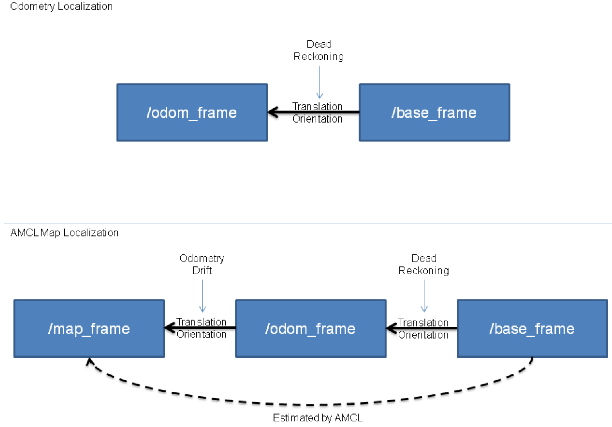

# 设置amcl参数

参考https://wiki.ros.org/amcl，amcl需要订阅以下话题：

> scan: laser scans.（important）
>
> tf: transform matrixes.（important）
>
> initialpose: mean and covariance with which to (re-)initialize the particle filter.(optional for users)
>
> map: map.（important）

并发布以下话题：

> amcl_pose
>
> particlecloud: where there generates the "PoseArray".
>
> tf: //todo: check the inheratance of the tfs.

为了能正常使用这个包，需要**正确配置坐标转换矩阵**。值得注意的是，在我们的实验中，由于机器大车结构较为复杂，坐标转换矩采用的是`odom_combined`而非`odom`。这将影响到最终的实验结果。

参考https://wiki.ros.org/amcl，有以下几个参数需要我们进行配置：

> `~odom_frame_id` (`string`, default: `"odom"`) Which frame to use for odometry. 和前文提到的一样，我们需要**把参数设置为**`odom_combined`。
>
> `base_frame_id` (`string`, default: `"base_link"`) Which frame to use for the robot base. 通常直接使用base_link即可，base_link为小车底盘中央的坐标系。详细请查看后文中对本实验的TF关系的梳理。如果有特殊需求，可以尝试使用laser作为这个参数。
>
> 此外，还有初始化的坐标信息，这一点内容较多，请参考ros wiki的内容。

因此，在launch文件中，应当着重关注以下参数：

```xml
  <!-- use topic named "map" -->
  <param name="use_map_topic" value="true"/>
  <!-- only use the first map -->
  <!-- param name="first_map_only", value="true"/-->
  <!-- use "odom_combined" as the transform matrix -->
  <param name="odom_frame_id" value="odom_combined"/>

  <!-- initialize the position -->
  <!-- param name="initial_pose_x" value="0.0"/-->
  <!-- param name="initial_pose_y" value="0.0"/-->
```

更多参数请参阅官方wiki。

我们使用的是差速例程，这个例程在本仓库的`src/amcl/examples/amcl_diff.launch`下。

# 设置hector_mapping参数

咕咕咕

参考https://wiki.ros.org/hector_mapping，同样可知其需要订阅的话题有：

> `scan` ([sensor_msgs/LaserScan](http://docs.ros.org/en/api/sensor_msgs/html/msg/LaserScan.html)): laser scans.（important）
>
> `syscommand` ([std_msgs/String](http://docs.ros.org/en/api/std_msgs/html/msg/String.html)): System command. If the string equals "reset" the map and robot pose are reset to their inital state.

需要我们特别关注的参数有：

> `base_frame` (`string`, default: base_link): The name of the base frame of the robot. This is the frame used for localization and for transformation of laser scan data. 手持雷达通常直接采用雷达的坐标。
>
> `odom_frame` (`string`, default: odom)： 里程计坐标。需要改用上文的`odom_combined`
>
> `~pub_map_odom_transform` (`bool`, default: true)：Determine if the map->odom transform should be published by the system. 可以选择为开启。

最后，launch文件中，需要重点配置的参数有：

```bash
    <!-- base frame defined. we use the laser itself. -->
    <param name="base_frame" value="laser" />
    <!-- change the odom_frame. -->
    <param name="odom_frame" value="odom_combined" />
    <!-- start the odom_pub, if we want to see both vehicle and constructed map on rviz. -->
    <param name="pub_map_odom_transform" value="true"/>
```

请参考`src/hector_mapping/launch/mapping_default.launch`

# TF关系

## 总TF关系：

```BASH
咕咕咕
```

## AMCL包相关的坐标转换关系

