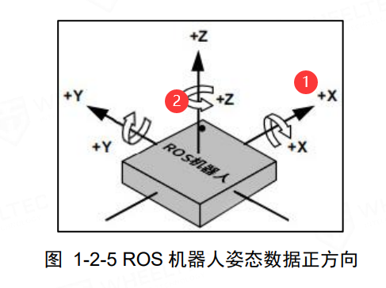

# 控制小车的移动示例

## 通过订阅话题，根据Twist实例变量向串口接收发送端进行通信

在ros端，小车的控制仅有两个可控制的自由度（窝也不知道这叫不叫自由度emmm求指点TvT），分别是：

> 沿小车**平动**方向的x轴
>
> 沿z坐标轴**转动**的控制

图示：



在Twist实例变量中，通过对Twist下的平动运动对象下的x、转动控制对象下的z进行控制：

```python
twist = Twist()
twist.linear.x = vx # 将x方向的目标速度传递给twist
twist.angulat.z = wz # 将绕z轴的转动角速度传递给twist
pub.publish(twist) # 发布twist。其中，pub是您已经订阅好了的话题。
```

详情请参考`src/key_example/key_control.py`。使用时，直接采用：

```py
python key_control.py
```

即可开启键盘控制。

注意，使用的时候，请先开启`turn_on_wheeltec_robot.launch`（或者仅运行其与串口通讯有关的节点），然后再运行本python文件。