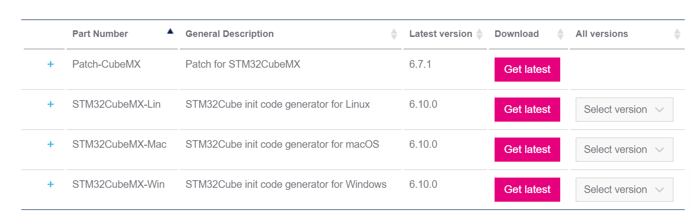
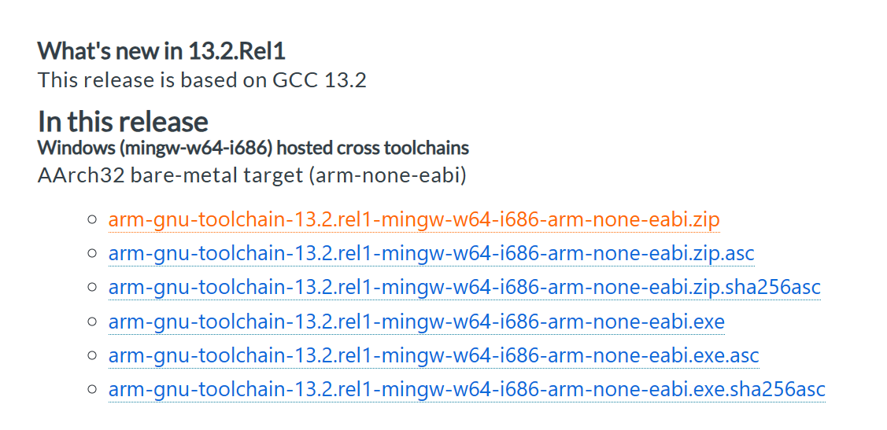
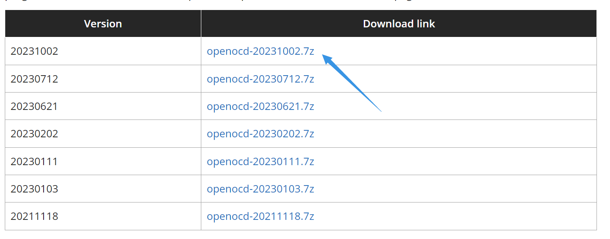

# 使用VSCode进行stm32的编译和烧录

请确保您有**jdk1.8**的环境标准。由于您上过电子科学创新实验1，本教程默认您拥有jdk1.8的环境。

此外，本教程默认您拥有Git的环境。

下载和配置环境过程中，需要您使用科学上网技术。

## 准备：

* STM32CubeMX软件：https://www.st.com/en/development-tools/stm32cubemx.html#get-software

选择合适的版本进行下载。windows系统通常选用`STM32CubeMX-Win`进行下载。



* 配置g++, gcc指令（可使用MinGW或）

由于需要使用cmake指令，所以需要配置c语言的环境。如果麻烦的话emmm用keil也可以的。

* 配置**arm-none-eabi-gcc**

下载地址：https://developer.arm.com/downloads/-/gnu-rm, 根据您的电脑系统下载。windows请选择windows系统下载。



* 配置OpenOCD（可选）

下载地址：https://gnutoolchains.com/arm-eabi/openocd/



选择最新一版下载。

**请务必记住下载这些文件的目的地址。**

## 环境变量的配置：

使用前，需要确保您的系统能够使用`gcc`, `g++`, `make`, `openocd`指令。

* gcc，g++，make指令的配置：

网上一抓一大把。

* 配置**arm-none-eabi-gcc**：

添加arm-gcc交叉编译器的环境变量，找到`gcc-arm-none-eabi-10.3-2021.10`下的`bin`目录

找到下载解压后的目录下的`bin`目录（**不要进入arm-none-eabi**这个不带数字的文件夹！），将这个地址进行复制到系统环境变量Path路径（或用户环境变量Path路径，如果你希望电脑上所有用户都能使用该变量，那么请添加到系统Path路径）的新建项下。

```bash
YOUR_PATH\gcc-arm-none-eabi-xx.xx-xxxx.xx\bin
```

* 配置OpenOCD

找到您所下载的`OpenOCD-xxxxxxxx-x.xx.x\bin`目录，将该目录复制到环境变量的Path中的新建项下。。

**确认您的环境变量信息：**

* gcc, g++, make：

  ```bash
  make -v
  %通常，配置好了make环境，gcc, g++大概率也配置的差不多了。不确定的话也可以对gcc，g++进行处理。
  ```

* **arm-none-eabi-gcc**

  ```bash
  arm-none-eabi-gcc -v
  ```

* OpenOCD

  ```bash
  openocd -v
  ```


上述的处理中，若出现正确的版本信息， 说明配置正确。


# 使用STM32CubeMX生成代码

不会。


# VSCode中的关联操作

## 安装stm32-for-vscode及相关插件

* stm32-for-vscode

在extension中，搜索`stm32-for-vscode`，安装。


如果环境变量正常配置，左侧窗口将会显示：


* C/C++自动补全


待更新