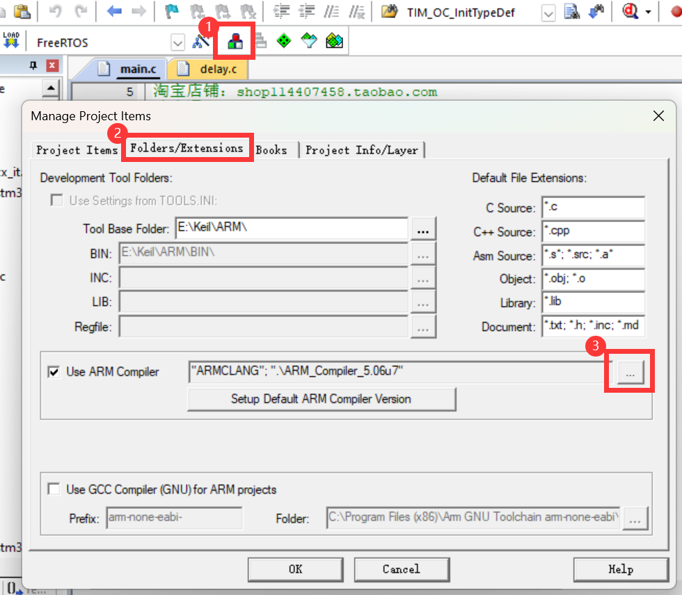
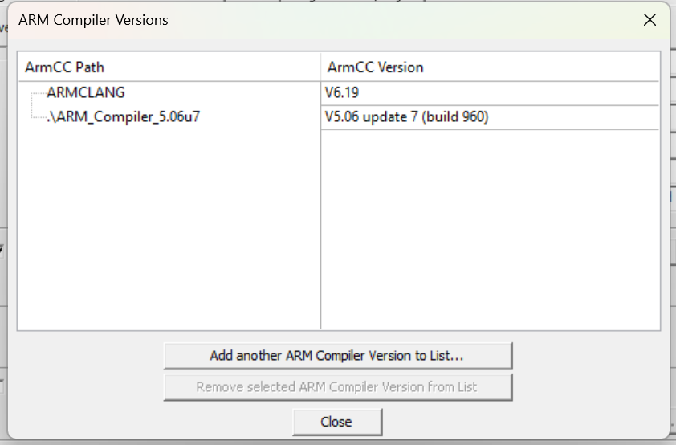
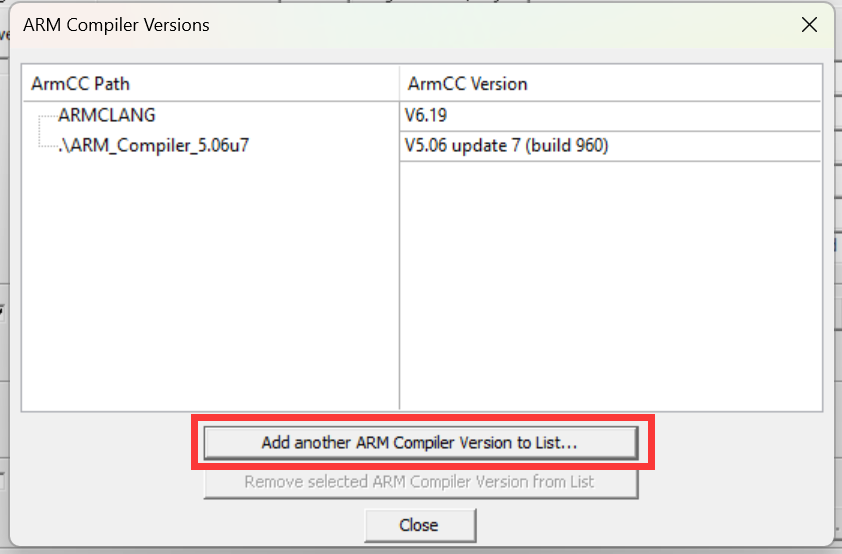
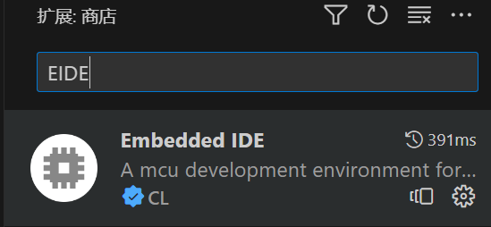
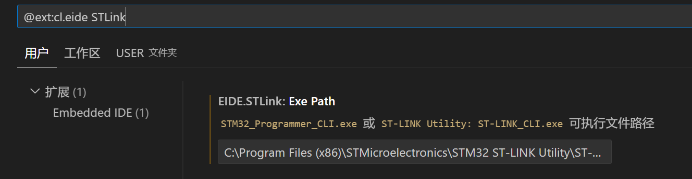
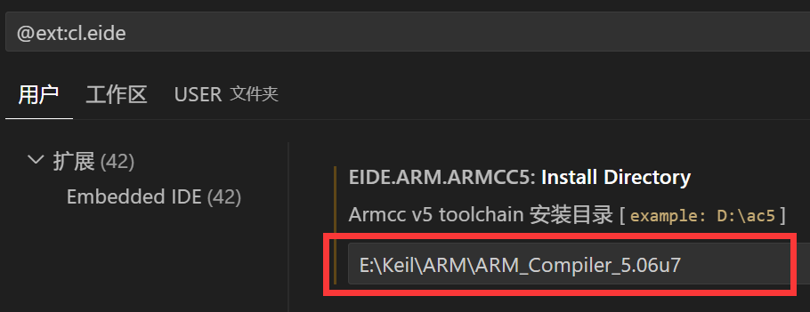
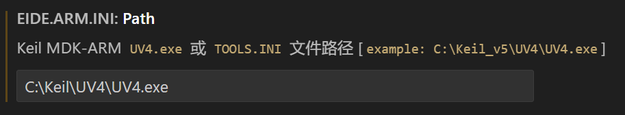

# 在vscode中，像keil一样对keil工程进行无缝衔接

首先，请确保您已经有了`gcc`,`g++`,`make`的环境，并拥有了`arm-none-eabi-gcc`环境。如果没有配置，请参考：[IntelligentAGV/doc/visual_studio_code_guilder/使用VSCode进行stm32的编译和烧录.md at main · Ethylene9160/IntelligentAGV (github.com)](https://github.com/Ethylene9160/IntelligentAGV/blob/main/doc/visual_studio_code_guilder/使用VSCode进行stm32的编译和烧录.md)。

除此，本教程默认您拥有可以正常使用的keil MDK，版本在5及以上。

# 在VSCode中对工程进行编写

* 确认和配置AC5（第五代ArmCC）编译组件

如果您不确定您是否安装AC5编译器，请打开keil并**按照顺序**点击：

可以查看您的`ArmCC`编译器版本。请留意您是否有`v5.x`版本的编译器。例如，上图存在`v5.06update7(build 960)`的AC5编译器。如果您已拥有该环境，您可跳过AC5的安装步骤，但**仍需要在VSCode中进行配置。**

> 安装AC5：
>
> 进入[Documentation – Arm Developer](https://developer.arm.com/documentation/ka005184/latest)，选择你喜欢的Arm Compiler 5.xx版本进行下载。
>
> 然后，请找到您的**Keil软件**（UV4.exe）所在的文件夹，进入`ARM`文件夹，并新建一个文件夹用于保存您的AC5编译器。该文件夹名字通常可采用`ARM_Compiler_5.xx`来表示，你也可以取一个你喜欢的名字，但是不要包含中文字符。请记住这个地址。
>
> 然后，请安装您所下载的Arm Compiler，**请将安装位置选择在您刚刚创建的文件夹**，并安装。
>
> 安装完成后，按照同样的方式来到这个窗口，点击`Add another ARM Compiler Version to List..`, 选中您刚才使用的文件夹并确认。若出现新的第五版本的编译器，则说明配置成功。
>
> 
>
> 

找到并记录您的AC5编译根目录地址（例如上图中的`ARM_Compiler_5.06u7`。

* 安装STLINK套件

进入[STSW-LINK004 - STM32 ST-LINK utility - STMicroelectronics](https://www.st.com/en/development-tools/stsw-link004.html#get-software)网站，选择适合您系统版本的STLINK套件，解压后安装。请**牢记您的安装位置**。这将在之后起到重要的作用。

* 安装Embedded IDE插件

在Visual Studio Code的`extension`中，搜索插件`Embedded IDE`然后安装。

安装后，请进入扩展设置页面，找到（或搜索）STLink：

将其地址设置为您安装STLink的目录下的`ST-LINK_CLK.exe`的地址。注意，安装STLink包后，这个可执行文件会在`ST-LINK Utility`目录下。注意，是在你的安装目录下的`ST-LINK Utility`目录下。

同样在扩展界面中找到（或搜索）ARMCC5安装位置配置，将刚才记录的AC5编译目录地址复制进去。（当然，该插件也有对ARMCC6的配置。本项目仅需要ArmCC5，但您若感兴趣，也可用相似的办法配置ArmCC6编译环境）

最后，将您的keil软件（UV4.exe）的安装位置配置进入：

祝贺你。最重要的环节结束了。

* 安装Keil Assistant插件

搜索`Keil Assistant`插件并安装即可。

祝贺你。在这之后，您便能够通过VSCode对该代码进行编撰和烧录了。

